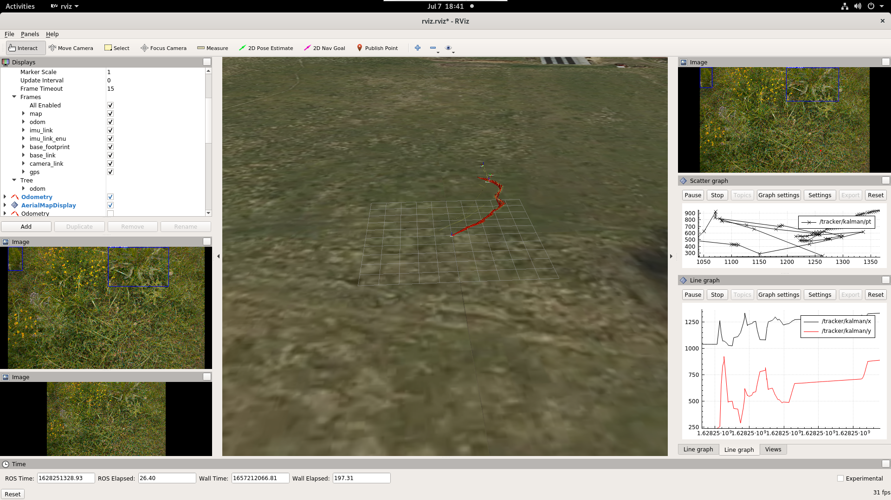
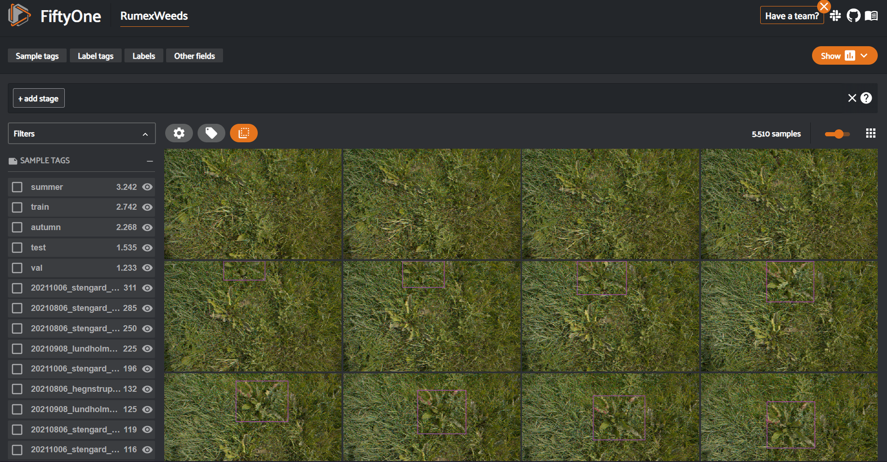

# RumexWeeds-ROS
This package contains the necessary build environment for the Docker container to deploy the development and simulation environment for the RumexWeeds dataset.
## Prerequisites
To execute the scripts and applications in the container, you need:
- an NVIDIA GPU which is CUDA capable and has sufficient memory (>=6 GB)
- Installation of Docker [[Docker Installation Guide](https://docs.docker.com/get-docker/)]
- Installation of the NVIDIA-Docker runtime [[NVIDIA-Docker Installation Guide](https://docs.nvidia.com/datacenter/cloud-native/container-toolkit/install-guide.html#docker)]
- The RumexWeeds dataset (link to be published soon)
- Installation of git-lfs:  `sudo apt-get install git-lfs`

## Building the docker image
This step will guide you through the process of building the docker image which will setup the ROS environment for you and also installs Fiftyone, Weights and Biases and YOLOR for you.


Before building the image, make sure that all Git submodules are up-to-date:
```
$ git submodule update --init --recursive --remote
```
Also, make sure that you download the pre-trained weights for the YOLOR model. This is done through git-lfs, but is not guaranteed to work as the repo has bandwith limits imposed by GitHub.
```
$ git lfs pull
```


To build the image, you execute the `deploy.sh` script. Make sure it's executable and do the follwing in the terminal:
```
$ ./deploy.sh
```
This will then build the image, which will take some minutes. Go get a coffee :coffee: !


## Running the container
To run the container with host networking and some other tweaks needed for a seamless execution of the applications inside the container, execute the following command:
```
$ docker run -it --name <NAME OF YOUR CHOICE> -e DISPLAY=$DISPLAY -it --security-opt apparmor=unconfined --gpus=all -v <PATH TO RUMEXWEEDS DATASET>:/RumexWeeds -v="<YOUR HOME DIRECTORY>/.Xauthority:/root/.Xauthority:rw" --network host rumexweeds_ros:latest
```
## Starting the ROS simulator
You can easily use ROS launch to start up the simulator:

```
roslaunch husky_ros launch_everything.launch use_sim_time:=False seq_dir:=/RumexWeeds/20210806_hegnstrup/seq11 local_inference:=True node_start_delay:=20.0 gui:=True
```
The launch file uses the following parameters:
- **use_sim_time**: Should be set to `False`, unless you know what you do
- **seq_dir**: Path to a sequence directory of RumexWeeds
- **local_inference**: Unless you have a NVIDIA Jetson NX with TensorRT and other dependencies installed, leave that parameter also as is. `False` would try to contact a Jetson via ssh and try to start up the `detector_tensorrt` node, which requires additional configuration and is not as easy to deploy as this.
- **node_start_delay**: Time between the detector node start and the dataset publisher nodes' start. This is needed to initialize the detector model and might need adjustments, depending on how fast your GPU is.
- **gui**: Whether to start the RVIZ Simulator GUI.

If everything works well, you should end up with something like this:


## Setting up FiftyOne
To visualize the dataset, you can initialize the already installed FiftyOne dataset management tool with a Python script. To add the dataset, do the following:
```
$ cd rumexweeds_github/utils/fiftyone && python3 init_dataset.py --dataset_dir=/RumexWeeds
```
You can already see the result then by launching up the web interface by opening up a Python3 console (`python3`) and type the follwing line-by-line:
```python
import fiftyone as fo

dataset = fo.load_dataset("RumexWeeds")
session = fo.Session(dataset=dataset, auto=False)
```
You should then be able to access the interface by visiting [http://localhost:5151](http://localhost:5151) and be welcomed by this screen:


## Preparing the YOLOR inference:
To get the predictions that can be added to FiftyOne, the dataset needs to be exported in a specific manner first:
```bash
$ cd /rumexweeds_github/utils/fiftyone && python3 export_yolor_dataset.py
```
This should create a dataset folder under `/RumexWeeds-YOLOR`

## Running the YOLOR inference
The following command will execute the inference:
```
$ cd /yolor && python3 test.py --batch-size=1 --cfg=cfg/yolor_csp_rumex.cfg --data=/RumexWeeds-YOLOR/dataset.yaml --device=0 --img-size=640 --names=/RumexWeeds-YOLOR/dataset.names --project=inference/csp --task=test --weights=best_ap.pt --save-txt --save-conf
```
You might be asked whether you want to log in to Weights and Biases, however, you can omit this for now by selecting option (3) when prompted to. Additionally, note that this is the standard configuration of the detector - confidence threshold of 0.001 and NMS threhold of 0.65. If you want to use the settings as in the thesis, add `--conf-thres 0.21 --iou-thres 0.15` to the command. Also note that this will only execute inference on the test split.

## Adding the predictions to FiftyOne:
When the inference is done, you can add the predictions to FiftyOne to visiualize them and eventually do some evaluations. The predictions can be added as follows:

```
$ python3 add_predictions_yolor.py --fo_field="predictions_yolor_csp" --preds_folder=/yolor/inference/csp/exp/labels
```
Note that the `preds_folder` might change, depending on how often you run the inference command. The preds folder is easily identified by having a look of the contents of the folder, it should contain many text files that contain the predictions.
